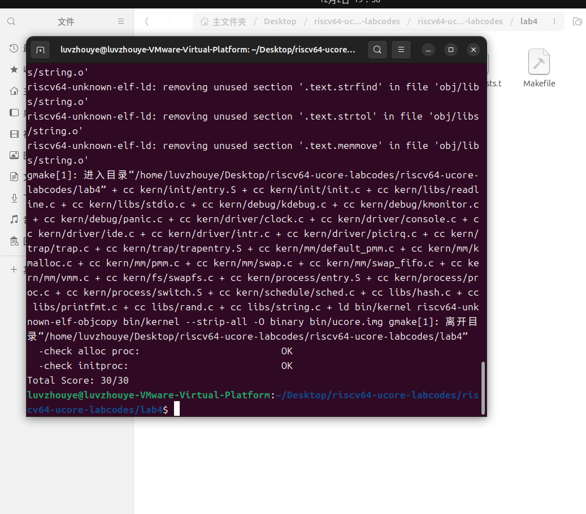

#lab4:进程管理
实验2/3完成了物理和虚拟内存管理，这给创建内核线程（内核线程是一种特殊的进程）打下了提供内存管理的基础。当一个程序加载到内存中运行时，首先通过ucore OS的内存管理子系统分配合适的空间，然后就需要考虑如何分时使用CPU来“并发”执行多个程序，让每个运行的程序（这里用线程或进程表示）“感到”它们各自拥有“自己”的CPU。

##实验目的
了解内核线程创建/执行的管理过程
了解内核线程的切换和基本调度过程


##实验内容
实验2/3完成了物理和虚拟内存管理，这给创建内核线程（内核线程是一种特殊的进程）打下了提供内存管理的基础。当一个程序加载到内存中运行时，首先通过ucore OS的内存管理子系统分配合适的空间，然后就需要考虑如何分时使用CPU来“并发”执行多个程序，让每个运行的程序（这里用线程或进程表示）“感到”它们各自拥有“自己”的CPU。

本次实验将首先接触的是内核线程的管理。内核线程是一种特殊的进程，内核线程与用户进程的区别有两个：

内核线程只运行在内核态
用户进程会在在用户态和内核态交替运行
所有内核线程共用ucore内核内存空间，不需为每个内核线程维护单独的内存空间
而用户进程需要维护各自的用户内存空间


提前说明：
需要注意的是，在ucore的调度和执行管理中，对线程和进程做了统一的处理。且由于ucore内核中的所有内核线程共享一个内核地址空间和其他资源，所以这些内核线程从属于同一个唯一的内核进程，即ucore内核本身。

##练习
对实验报告的要求：

基于markdown格式来完成，以文本方式为主
填写各个基本练习中要求完成的报告内容
列出你认为本实验中重要的知识点，以及与对应的OS原理中的知识点，并简要说明你对二者的含义，关系，差异等方面的理解（也可能出现实验中的知识点没有对应的原理知识点）
列出你认为OS原理中很重要，但在实验中没有对应上的知识点

###练习0：填写已有实验
本实验依赖实验2/3。请把你做的实验2/3的代码填入本实验中代码中有“LAB2”,“LAB3”的注释相应部分。

###练习1：分配并初始化一个进程控制块（需要编码）

alloc_proc函数（位于kern/process/proc.c中）负责分配并返回一个新的struct proc_struct结构，用于存储新建立的内核线程的管理信息。ucore需要对这个结构进行最基本的初始化，你需要完成这个初始化过程。

【提示】在alloc_proc函数的实现中，需要初始化的proc_struct结构中的成员变量至少包括：state/pid/runs/kstack/need_resched/parent/mm/context/tf/cr3/flags/name。

请在实验报告中简要说明你的设计实现过程。请回答如下问题：

请说明proc_struct中struct context context和struct trapframe *tf成员变量含义和在本实验中的作用是啥？（提示通过看代码和编程调试可以判断出来）


###练习2：为新创建的内核线程分配资源（需要编码）

创建一个内核线程需要分配和设置好很多资源。kernel_thread函数通过调用do_fork函数完成具体内核线程的创建工作。do_kernel函数会调用alloc_proc函数来分配并初始化一个进程控制块，但alloc_proc只是找到了一小块内存用以记录进程的必要信息，并没有实际分配这些资源。ucore一般通过do_fork实际创建新的内核线程。do_fork的作用是，创建当前内核线程的一个副本，它们的执行上下文、代码、数据都一样，但是存储位置不同。因此，我们实际需要"fork"的东西就是stack和trapframe。在这个过程中，需要给新内核线程分配资源，并且复制原进程的状态。你需要完成在kern/process/proc.c中的do_fork函数中的处理过程。它的大致执行步骤包括：

调用alloc_proc，首先获得一块用户信息块。
为进程分配一个内核栈。
复制原进程的内存管理信息到新进程（但内核线程不必做此事）
复制原进程上下文到新进程
将新进程添加到进程列表
唤醒新进程
返回新进程号


```c
int do_fork(uint32_t clone_flags, uintptr_t stack, struct trapframe *tf) {
    int ret = -E_NO_FREE_PROC;  // 初始化返回值为 -E_NO_FREE_PROC，表示没有可用的进程空间
    struct proc_struct *proc;  // 定义指向新进程的指针

    if (nr_process >= MAX_PROCESS) {
        // 如果当前进程数大于等于最大进程数限制，则跳转到退出部分
        goto fork_out;
    }
    
    ret = -E_NO_MEM;  // 假设内存分配失败，初始化错误码
    if ((proc = alloc_proc()) == NULL) {
        // 尝试分配一个新的进程结构（proc），如果失败则跳转到清理操作
        goto bad_fork_cleanup_kstack;
    }

    proc->parent = current; // 设置父进程为当前进程。父进程是创建子进程的进程，`current` 是当前运行的进程

    if (setup_kstack(proc) != 0) {
        // 为子进程分配内核栈，如果失败则跳转到清理操作
        goto bad_fork_cleanup_proc;
    }

    if (copy_mm(clone_flags, proc) != 0) {
        // 根据 `clone_flags` 复制或共享父进程的内存管理结构。如果返回非零值，说明出错，跳转到清理内核栈
        goto bad_fork_cleanup_kstack;
    }

    copy_thread(proc, stack, tf);  // 复制父进程的寄存器状态到新进程，并设置新进程的上下文

    proc->pid = get_pid();  // 分配一个唯一的 PID 给新进程。`get_pid` 会生成并返回一个新的进程 ID。

    setup_kstack(proc);  

    hash_proc(proc);  // 将新进程加入进程哈希表，便于管理进程

    list_add(&proc_list, &(proc->list_link));  // 将新进程插入到进程链表中，`proc_list` 是系统中进程的总列表

    nr_process++;  // 增加全局进程计数器，表示系统中进程的数量增加

    wakeup_proc(proc);  // 将新进程的状态设置为可调度的，表示进程现在是可运行的，调度器可以开始调度它

    ret = proc->pid;  // 设置返回值为新创建进程的 PID，表示操作成功

fork_out:
    return ret;  // 返回新进程的 PID，或者错误码（如果发生了错误）

bad_fork_cleanup_kstack:
    put_kstack(proc);  // 如果进程分配失败，释放分配的内核栈

bad_fork_cleanup_proc:
    kfree(proc);  // 如果进程分配失败，释放分配的进程结构体

    goto fork_out;  // 继续到退出部分，返回错误码
}


```

涉及到的函数解析：

```c
static int get_pid(void) {
    static_assert(MAX_PID > MAX_PROCESS);  // 确保系统的最大PID数量大于最大进程数，以防出现PID分配不足的情况
    struct proc_struct *proc;  // 定义一个指向进程结构体的指针
    list_entry_t *list = &proc_list, *le;  // 创建一个指向进程链表的指针，`proc_list` 是全局进程链表的头指针
    static int next_safe = MAX_PID, last_pid = MAX_PID;  // `next_safe` 是下一个安全的PID，`last_pid` 是上一次分配的PID

    if (++ last_pid >= MAX_PID) {  // 如果 `last_pid` 达到最大PID，重新从1开始
        last_pid = 1;
        goto inside;  // 跳转到 `inside` 标签
    }

    if (last_pid >= next_safe) {  // 如果 `last_pid` 已经超过了安全PID的范围
        inside:
        next_safe = MAX_PID;  // 设置下一个安全的PID为最大PID值
    }

    repeat:
    le = list;  // 设置链表指针 `le` 为 `list`（链表头）
    while ((le = list_next(le)) != list) {  // 遍历进程链表，直到回到链表头
        proc = le2proc(le, list_link);  // 从链表项中获取进程结构体指针
        if (proc->pid == last_pid) {  // 如果当前进程的PID与 `last_pid` 相同
            if (++ last_pid >= next_safe) {  // 如果 `last_pid` 达到或超过了安全PID
                if (last_pid >= MAX_PID) {  // 如果 `last_pid` 超过最大PID
                    last_pid = 1;  // 从1重新开始
                }
                next_safe = MAX_PID;  // 重置 `next_safe` 为最大PID
                goto repeat;  // 跳转回 `repeat` 标签，重新进行查找
            }
        }
        else if (proc->pid > last_pid && next_safe > proc->pid) {  // 如果找到一个PID大于 `last_pid` 且比 `next_safe` 小的进程
            next_safe = proc->pid;  // 更新 `next_safe` 为该进程的PID
        }
    }

    return last_pid;  // 返回当前的 `last_pid`，作为新的PID分配给新进程
}

```
这个函数的目的是生成一个唯一的进程ID (PID) 给新的进程。它首先检查并增加 last_pid，然后遍历已存在的进程，确保 last_pid 没有重复。如果找到了重复的PID，它会继续递增，直到找到一个未使用的PID为止。
```c
static void hash_proc(struct proc_struct *proc) {
    list_add(hash_list + pid_hashfn(proc->pid), &(proc->hash_link));
}

```
这个函数的作用是将一个新的进程 proc 插入到哈希表中。通过哈希函数 pid_hashfn(proc->pid)，它将进程插入到对应的链表中。这样，所有进程根据其 PID 被分布到不同的链表桶里，以便快速查找和管理。

```c
static int setup_kstack(struct proc_struct *proc) {
    struct Page *page = alloc_pages(KSTACKPAGE);
    if (page != NULL) {
        proc->kstack = (uintptr_t)page2kva(page);
        return 0;
    }
    return -E_NO_MEM;
}

```
alloc_pages 是一个内存分配函数，用于为内核分配一块或多块内存页。它返回一个指向 struct Page 类型的指针，表示分配的内存页。
KSTACKPAGE 是一个常量，表示所需的内存页数。通常，这个值会设置为 1，表示为内核栈分配一页内存。如果内存页分配成功，使用 page2kva(page) 将分配到的内存页的物理地址转换为内核虚拟地址。
page2kva 是一个宏或函数，它将一个 struct Page 指针转换为该页的虚拟地址。
proc->kstack 是进程结构体中的一个字段，用来存储该进程的内核栈的虚拟地址。通过这行代码，将内核栈的地址赋给进程的 kstack 字段。如果内存分配失败（page == NULL），返回 -E_NO_MEM 错误码，表示没有足够的内存来分配内核栈。
-E_NO_MEM 是一个常见的错误码，通常定义为 -12，表示内存不足。

```c
static int setup_kstack(struct proc_struct *proc) {
    struct Page *page = alloc_pages(KSTACKPAGE);  // 分配内核栈的页面
    if (page != NULL) {  // 如果成功分配内存页
        proc->kstack = (uintptr_t)page2kva(page);  // 获取内核虚拟地址并赋值给进程的内核栈指针
        return 0;  // 成功分配并设置内核栈，返回 0
    }
    return -E_NO_MEM;  // 分配失败，返回内存不足的错误码
}

```
setup_kstack 函数的作用是为指定的进程 proc 分配一个内核栈。如果分配成功，它会将分配到的内核栈的虚拟地址赋值给 proc->kstack，并返回 0 表示成功。如果内存分配失败，则返回 -E_NO_MEM 错误代码。这是内核为进程创建必要的内核栈空间的一个步骤。


```c
static void copy_thread(struct proc_struct *proc, uintptr_t esp, struct trapframe *tf) {
    proc->tf = (struct trapframe *)(proc->kstack + KSTACKSIZE - sizeof(struct trapframe));  // 为进程分配 trapframe，指向内核栈末尾
    *(proc->tf) = *tf;  // 将父进程的 trapframe 复制到子进程的 trapframe

    // Set a0 to 0 so a child process knows it's just forked
    proc->tf->gpr.a0 = 0;  // 设置 a0 寄存器为 0，表示该进程是子进程

    proc->tf->gpr.sp = (esp == 0) ? (uintptr_t)proc->tf : esp;  // 设置栈指针，若 esp 为 0，则使用 proc->tf 作为栈指针

    proc->context.ra = (uintptr_t)forkret;  // 设置返回地址为 forkret 函数的地址
    proc->context.sp = (uintptr_t)(proc->tf);  // 设置上下文的栈指针为 proc->tf
}

```
copy_thread 函数的主要任务是为新创建的进程设置线程上下文。具体操作包括：

分配并初始化 trapframe，将其设置为内核栈的末尾。
复制父进程的 trapframe，继承父进程的寄存器状态。
设置 a0 寄存器为 0，表示该进程是子进程。
设置栈指针 sp。
设置返回地址 ra 和上下文的栈指针 sp。
这些操作确保新创建的进程能够在恰当的状态下从 trapframe 开始执行，并正确返回至 forkret 函数。


请在实验报告中简要说明你的设计实现过程。请回答如下问题：

请说明ucore是否做到给每个新fork的线程一个唯一的id？请说明你的分析和理由。

在 `ucore` 操作系统中，创建新进程时，通常会为每个进程分配一个唯一的进程 ID（PID）。而线程的处理，在 `ucore` 的设计中没有明确指出每个新创建的线程是否会分配一个独立的 ID，这主要取决于 `clone_flags` 和操作系统如何处理多线程的实现。

1. **进程（Process）和线程（Thread）的区别**：
   - 在大多数操作系统中，**进程**是具有自己独立地址空间、内存管理和调度的实体。每个进程都有一个唯一的 PID。
   - **线程**是进程中的执行单元，多个线程共享进程的地址空间和资源。在许多系统中，线程并不一定有单独的 ID，而是共享进程的 PID。

2. **`do_fork`函数中的PID分配**：
   - 在 `ucore` 中，`do_fork` 函数是用来创建新进程的，通常涉及进程的复制（例如复制进程的内存、寄存器状态等）。
   - 在 `do_fork` 中，调用了 `get_pid()` 函数来为新进程分配一个 **唯一的PID**。这是通过遍历所有现有进程，并确保新进程的 PID 不与现有进程重复来实现的。
   - 这一过程确保了每个新创建的进程都会分配到一个唯一的 PID，但这并不自动为每个线程分配一个单独的线程 ID。


###练习3：编写proc_run 函数（需要编码）


proc_run用于将指定的进程切换到CPU上运行。它的大致执行步骤包括：

检查要切换的进程是否与当前正在运行的进程相同，如果相同则不需要切换。
禁用中断。你可以使用/kern/sync/sync.h中定义好的宏local_intr_save(x)和local_intr_restore(x)来实现关、开中断。
切换当前进程为要运行的进程。
切换页表，以便使用新进程的地址空间。/libs/riscv.h中提供了lcr3(unsigned int cr3)函数，可实现修改CR3寄存器值的功能。
实现上下文切换。/kern/process中已经预先编写好了switch.S，其中定义了switch_to()函数。可实现两个进程的context切换。
允许中断。
请回答如下问题：

在本实验的执行过程中，创建且运行了几个内核线程？
完成代码编写后，编译并运行代码：make qemu

如果可以得到如 附录A所示的显示内容（仅供参考，不是标准答案输出），则基本正确。

###扩展练习 Challenge：


说明语句local_intr_save(intr_flag);....local_intr_restore(intr_flag);是如何实现开关中断的？



