# lab5:用户程序

## 实验4完成了内核线程，但到目前为止，所有的运行都在内核态执行。实验5将创建用户进程，让用户进程在用户态执行，且在需要ucore支持时，可通过系统调用来让ucore提供服务。

## 实验目的

了解第一个用户进程创建过程

了解系统调用框架的实现机制

了解ucore如何实现系统调用sys_fork/sys_exec/sys_exit/sys_wait来进行进程管理

## 实验内容
实验4完成了内核线程，但到目前为止，所有的运行都在内核态执行。实验5将创建用户进程，让用户进程在用户态执行，且在需要ucore支持时，可通过系统调用来让ucore提供服务。为此需要构造出第一个用户进程，并通过系统调用sys_fork/sys_exec/sys_exit/sys_wait来支持运行不同的应用程序，完成对用户进程的执行过程的基本管理。

## 练习
对实验报告的要求：

基于markdown格式来完成，以文本方式为主
填写各个基本练习中要求完成的报告内容
列出你认为本实验中重要的知识点，以及与对应的OS原理中的知识点，并简要说明你对二者的含义，关系，差异等方面的理解（也可能出现实验中的知识点没有对应的原理知识点）
列出你认为OS原理中很重要，但在实验中没有对应上的知识点

## 练习0：填写已有实验

本实验依赖实验2/3/4。请把你做的实验2/3/4的代码填入本实验中代码中有“LAB2”/“LAB3”/“LAB4”的注释相应部分。注意：为了能够正确执行lab5的测试应用程序，可能需对已完成的实验2/3/4的代码进行进一步改进。

修改代码如下图：

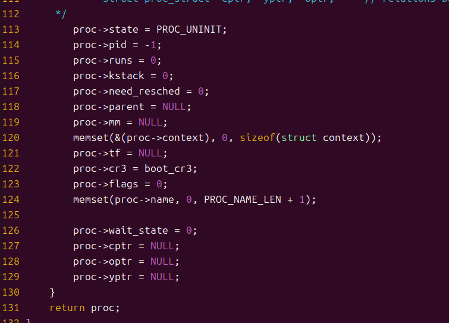

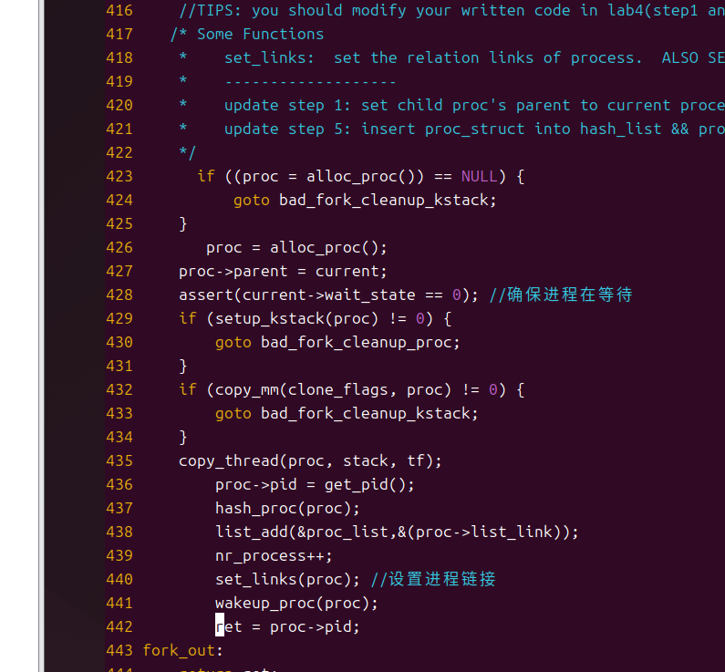

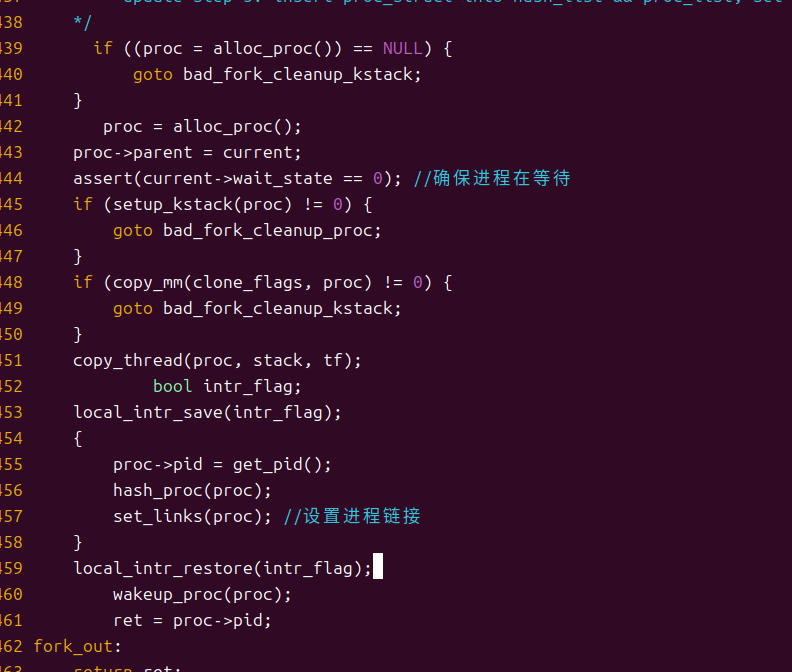

## 练习1: 加载应用程序并执行（需要编码）

do_execv函数调用load_icode（位于kern/process/proc.c中）来加载并解析一个处于内存中的ELF执行文件格式的应用程序。你需要补充load_icode的第6步，建立相应的用户内存空间来放置应用程序的代码段、数据段等，且要设置好proc_struct结构中的成员变量trapframe中的内容，确保在执行此进程后，能够从应用程序设定的起始执行地址开始执行。需设置正确的trapframe内容。

请在实验报告中简要说明你的设计实现过程。

请简要描述这个用户态进程被ucore选择占用CPU执行（RUNNING态）到具体执行应用程序第一条指令的整个经过。
```c
     tf->gpr.sp = USTACKTOP;
     tf->epc = elf->e_entry;
     tf->status = sstatus & ~(SSTATUS_SPP | SSTATUS_SPIE);
```

tf->gpr.sp = USTACKTOP;

作用：设置 sp（栈指针）为 USTACKTOP，这是用户栈的顶端。

tf 是一个指向 trapframe 结构体的指针，gpr 是 trapframe 结构体中的通用寄存器集合，sp 是其中的栈指针（Stack Pointer），用于指向当前栈的顶部。USTACKTOP 是一个宏，定义了用户堆栈的起始地址。

tf->epc = elf->e_entry;

作用：将程序计数器 epc 设置为可执行文件 ELF 文件的入口点 e_entry。当从内核返回到用户空间时，程序将从这里开始执行。

epc是存储当前执行指令地址的寄存器。在 RISC-V 中，epc 寄存器存储程序计数器的值。elf->e_entry 是从 ELF 文件头中获取的程序的入口点地址（即程序的起始执行地址）。ELF是可执行文件的标准格式，它包含了程序的各个部分（例如代码段、数据段等）。e_entry 是该文件中程序的起始地址。

tf->status = sstatus & ~(SSTATUS_SPP | SSTATUS_SPIE);

作用：设置 status 寄存器，确保进程从用户模式启动，且禁用中断。

sstatus 是当前状态寄存器，用来存储 CPU 的状态信息。SSTATUS_SPP 和 SSTATUS_SPIE 是其中的标志位，控制着特权级和中断状态。

SSTATUS_SPP：表示当前操作模式的标志位。当 SSTATUS_SPP 为 1 时，表示上一个操作模式是 Supervisor（内核模式），为 0 时表示是 User（用户模式）。

SSTATUS_SPIE：表示中断使能的标志位。SPIE 表示 Supervisor 模式下的中断启用位。SPIE 为 1 表示中断启用，为 0 表示中断禁用。

sstatus & ~(SSTATUS_SPP | SSTATUS_SPIE) 是对 sstatus 的位操作，清除 SSTATUS_SPP 和 SSTATUS_SPIE，即：设置 SSTATUS_SPP 为 0，表示程序将从用户模式开始执行。
设置 SSTATUS_SPIE 为 0，表示禁用中断（即进入无中断模式，直到中断被显式地重新启用）。确保当前进程从用户模式开始，并且禁止中断。这样可以确保进程启动时处于干净的状态，避免因中断干扰而影响进程执行。


load_icode()函数：
此函数是一个内核函数，作用为将 ELF 格式的二进制程序加载到当前进程的地址空间中，并为该进程设置合适的内存映射、堆栈以及寄存器。它是进程创建或用户程序执行的一个重要部分。具体步骤如下：


```c
if (current->mm != NULL) {
    panic("load_icode: current->mm must be empty.\n");
}
```

首先，函数确保当前进程（`current`）的内存管理结构（`mm`）为空。`mm` 是用来管理进程虚拟内存的结构体，如果它不为空，意味着进程已经有了内存映射，因此不能加载新的二进制程序。


```c
struct mm_struct *mm;
if ((mm = mm_create()) == NULL) {
    goto bad_mm;
}
```

如果当前进程没有内存管理结构，函数创建一个新的内存管理结构 `mm`。若创建失败，函数将跳转到 `bad_mm` 错误处理部分。


```c
if (setup_pgdir(mm) != 0) {
    goto bad_pgdir_cleanup_mm;
}
```

创建并初始化新的页表，将进程的页目录指针（`pgdir`）指向内核为进程分配的页表结构。若页表设置失败，跳转到 `bad_pgdir_cleanup_mm`。


```c
struct elfhdr *elf = (struct elfhdr *)binary;
struct proghdr *ph = (struct proghdr *)(binary + elf->e_phoff);
if (elf->e_magic != ELF_MAGIC) {
    ret = -E_INVAL_ELF;
    goto bad_elf_cleanup_pgdir;
}
```

此时，函数开始解析 ELF 格式的二进制文件。首先，它检查 ELF 文件的魔数（`e_magic`），以确认文件是否为有效的 ELF 格式。如果不是，返回 `-E_INVAL_ELF` 错误。

`ph` 是指向程序头表的指针，`e_phoff` 指向程序头表的偏移地址。ELF 文件的程序头表包含了文件中各个加载段的信息。


```c
for (; ph < ph_end; ph ++) {
    if (ph->p_type != ELF_PT_LOAD) {
        continue;
    }
    if (ph->p_filesz > ph->p_memsz) {
        ret = -E_INVAL_ELF;
        goto bad_cleanup_mmap;
    }
    ...
}
```

接下来，函数遍历 ELF 文件的每个程序头，检查其类型是否为 `ELF_PT_LOAD`（表示该段是可加载段）。对于每个加载段，检查文件大小 `p_filesz` 是否大于其分配内存大小 `p_memsz`，如果是，说明 ELF 文件有问题，返回错误。


```c
vm_flags = 0, perm = PTE_U | PTE_V;
if (ph->p_flags & ELF_PF_X) vm_flags |= VM_EXEC;
if (ph->p_flags & ELF_PF_W) vm_flags |= VM_WRITE;
if (ph->p_flags & ELF_PF_R) vm_flags |= VM_READ;
```

接下来，根据段的标志位设置该段的内存映射权限。每个段的权限由其 `p_flags` 字段决定：

- `ELF_PF_X`：可执行
- `ELF_PF_W`：可写
- `ELF_PF_R`：可读

通过 `vm_flags` 设置相应的标志位，再通过 `perm` 设置对应的权限（如读、写、执行）。


```c
unsigned char *from = binary + ph->p_offset;
size_t off, size;
uintptr_t start = ph->p_va, end, la = ROUNDDOWN(start, PGSIZE);
...
while (start < end) {
    if ((page = pgdir_alloc_page(mm->pgdir, la, perm)) == NULL) {
        goto bad_cleanup_mmap;
    }
    ...
    memcpy(page2kva(page) + off, from, size);
    start += size, from += size;
}
```

对于每个加载段，函数为该段在进程地址空间中分配内存并将 ELF 文件中的数据拷贝到分配的内存中。每个段的内存会根据页大小进行对齐（`ROUNDDOWN`）。如果内存分配失败，跳转到 `bad_cleanup_mmap`。


```c
end = ph->p_va + ph->p_memsz;
if (start < la) {
    ...
    memset(page2kva(page) + off, 0, size);
    start += size;
}
```

BSS 段是未初始化的全局变量的内存区域，通常需要将其初始化为零。对于 BSS 段，函数会根据程序头的 `p_memsz` 字段，使用 `memset` 将未初始化的内存区域填充为零。


```c
vm_flags = VM_READ | VM_WRITE | VM_STACK;
if ((ret = mm_map(mm, USTACKTOP - USTACKSIZE, USTACKSIZE, vm_flags, NULL)) != 0) {
    goto bad_cleanup_mmap;
}
```

在内存中为用户栈分配空间，栈的大小为 `USTACKSIZE`，并将其映射到虚拟地址 `USTACKTOP - USTACKSIZE`。


```c
mm_count_inc(mm);
current->mm = mm;
current->cr3 = PADDR(mm->pgdir);
lcr3(PADDR(mm->pgdir));
```

设置当前进程的 `mm`（内存管理结构）和 `cr3` 寄存器（页表的物理地址）。`lcr3` 是一个内核函数，用于加载页目录基址寄存器。


```c
struct trapframe *tf = current->tf;
uintptr_t sstatus = tf->status;
memset(tf, 0, sizeof(struct trapframe));
tf->gpr.sp = USTACKTOP;
tf->epc = elf->e_entry;
tf->status = sstatus & ~(SSTATUS_SPP | SSTATUS_SPIE);
```

设置进程的 `trapframe`。`trapframe` 结构体保存了进程的寄存器状态。主要需要设置：

- `sp`（堆栈指针）：指向用户栈的顶部。
- `epc`（程序计数器）：设置为 ELF 文件中的入口点 `e_entry`，表示程序开始执行的地方。
- `status`：更新为适用于用户程序的状态，清除 `SSTATUS_SPP` 和 `SSTATUS_SPIE` 标志。


```c
ret = 0;
out:
return ret;
```

如果一切顺利，函数返回 0，表示成功加载了二进制程序。否则，函数会根据不同的错误情况跳转到相应的错误处理部分，并释放已分配的资源。

**错误处理：**

- `bad_mm`：内存管理结构创建失败。
- `bad_pgdir_cleanup_mm`：页表设置失败，清理内存管理结构。
- `bad_elf_cleanup_pgdir`：ELF 文件格式无效，清理页表。
- `bad_cleanup_mmap`：内存映射设置失败，清理已分配的内存。

**总结：**

current->mm 表示当前进程的内存管理结构体（mm_struct），用于管理该进程的虚拟地址空间。如果已经有映射（即该进程已经有内存空间被分配），则无法加载新程序，因此报错并终止。
创建一个新的内存管理结构体 mm，用于管理该进程的虚拟内存。若创建失败，则跳转至错误处理部分。
设置新进程的页面目录（PDT），即为该进程建立一个虚拟地址空间映射。setup_pgdir 负责分配和初始化页表，并设置页目录。若失败，进行清理操作。
通过 binary 获取 ELF 文件头（elfhdr），然后解析程序头表（proghdr）。检查 ELF 文件是否有效（即 e_magic 字段是否为有效的 ELF 魔术数）。
遍历程序头表，处理每个加载类型为 ELF_PT_LOAD 的段（这些段是可加载到内存中的部分，如代码段和数据段）。如果程序头类型不是加载类型，跳过。
为每个加载的程序段映射内存空间。mm_map 函数会根据程序段的虚拟地址（p_va）和段的内存大小（p_memsz）来分配内存。

```c
mm_count_inc(mm);
current->mm = mm;
current->cr3 = PADDR(mm->pgdir);
lcr3(PADDR(mm->pgdir));
```

将当前进程的 mm 设置为新的内存管理结构，更新页目录地址，并刷新 TLB（转换后备页表）。


### 用户态进程从 RUNNING 状态到执行程序的第一条指令的过程

- 首先调用load_icode函数来加载应用程序：

为用户进程创建新的mm结构，创建页目录表，创建虚拟内存空间，即往mm结构体添加vma结构，分配内存，并拷贝ELF文件的各个program section到新申请的内存上，为BSS section分配内存，并初始化为全0，分配用户栈内存空间，设置当前用户进程的mm结构、页目录表的地址及加载页目录表地址到cr3寄存器，系统通过 mm_map 映射内存区域，通过 pgdir_alloc_page 分配物理页面。在加载完程序后，系统会设置 trapframe，这是进程在执行期间保存寄存器值的地方。此时，系统通过修改 trapframe 设置程序计数器 epc 为 ELF 文件中的入口点，并设置栈指针 sp。

- load_icode返回到do_exevce，do_execve设置完当前用户进程的名字为“exit”后也返回了。这样一直原路返回到__alltraps函数时，接下来进入__trapret函数。__trapret函数先将栈上保存的tf的内容pop给相应的寄存器，然后跳转应用程序的入口（exit.c文件中的main函数），特权级也由内核态跳转到用户态（sret），接下来就开始执行用户程序。


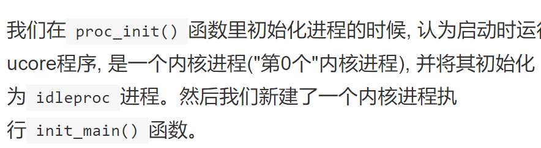
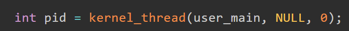
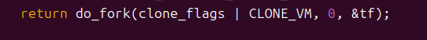
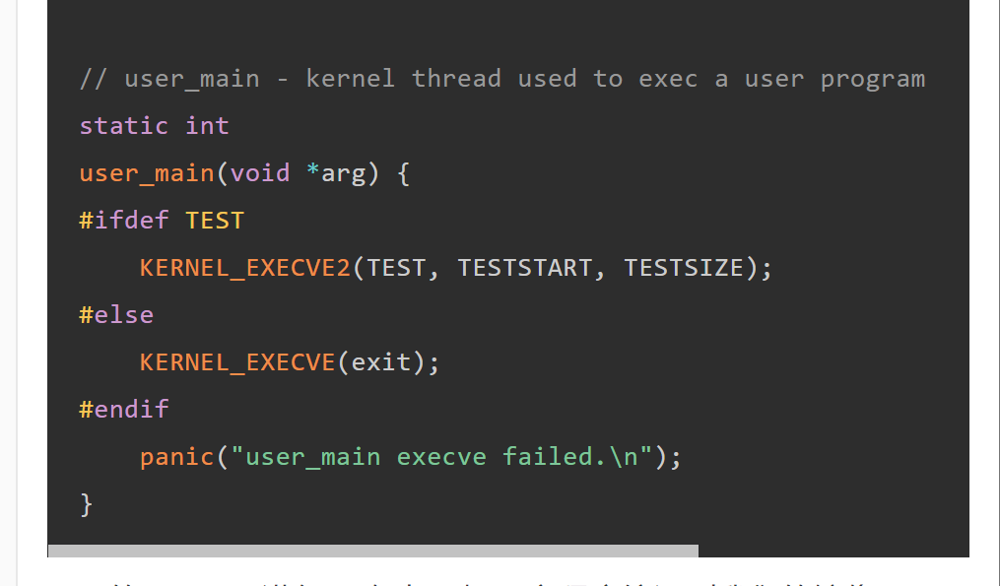
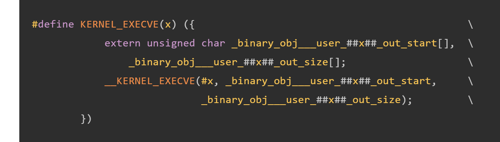
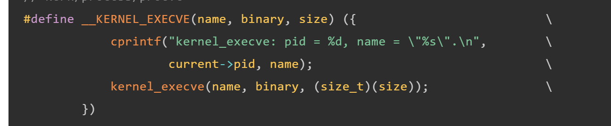
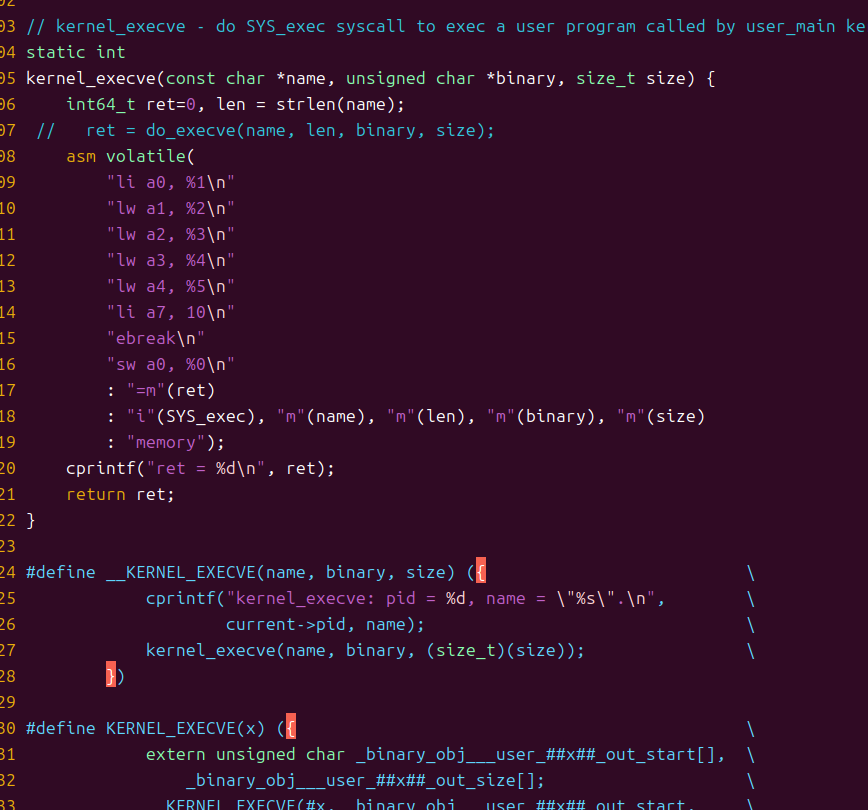
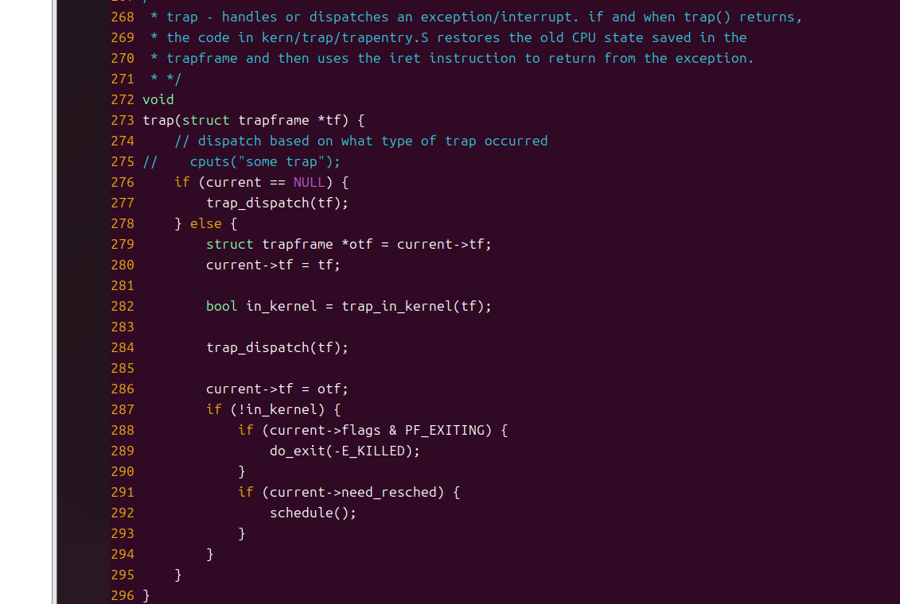
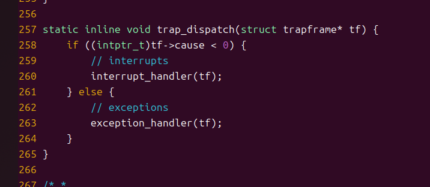
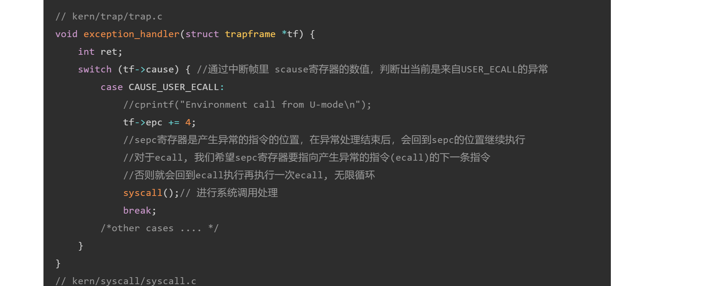
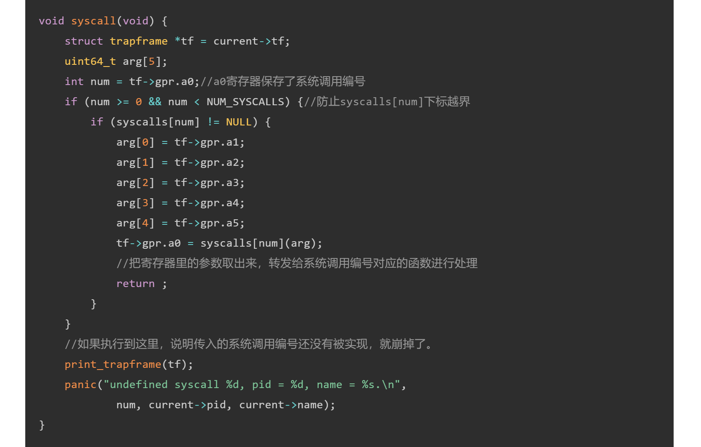
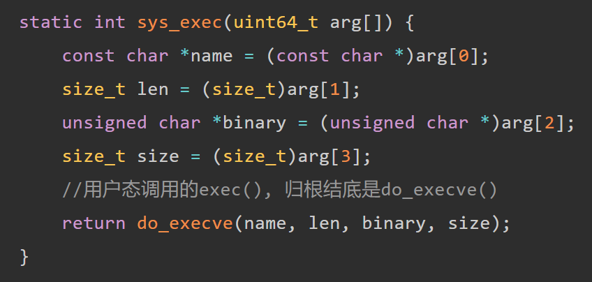
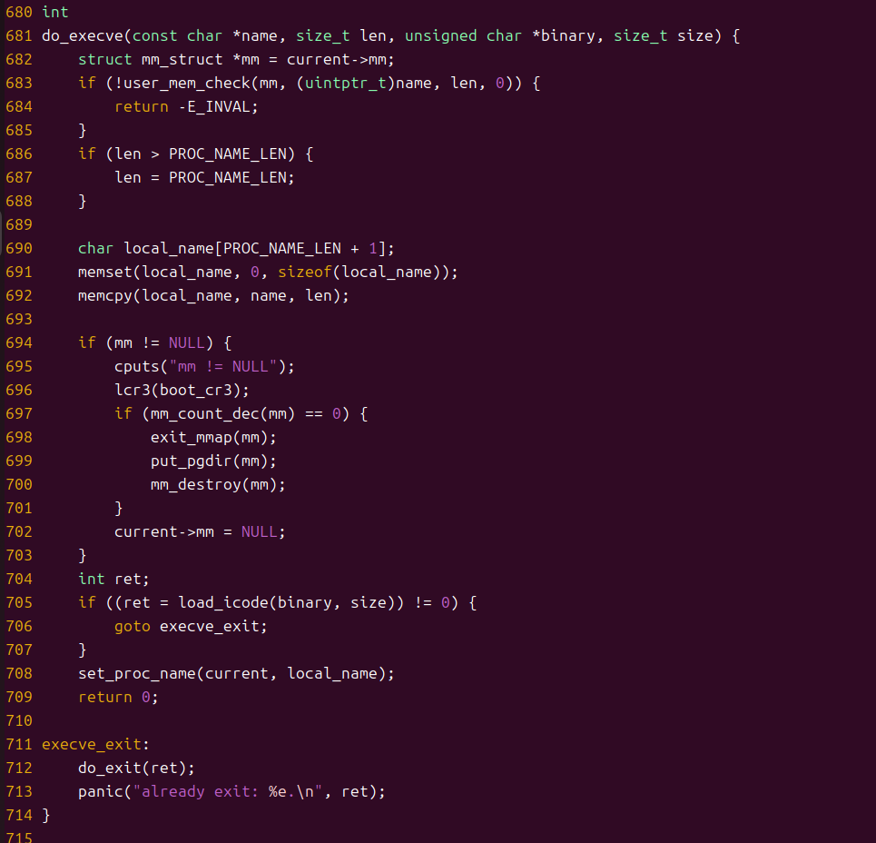

## 练习2: 父进程复制自己的内存空间给子进程（需要编码）

创建子进程的函数do_fork在执行中将拷贝当前进程（即父进程）的用户内存地址空间中的合法内容到新进程中（子进程），完成内存资源的复制。具体是通过copy_range函数（位于kern/mm/pmm.c中）实现的，请补充copy_range的实现，确保能够正确执行。

请在实验报告中简要说明你的设计实现过程。

```c
// (1) 获取源页面的内核虚拟地址
                void *src_kvaddr = page2kva(page);
                // (2) 获取目标页面的内核虚拟地址
                void *dst_kvaddr = page2kva(npage);
                // (3) 将源页面的内容复制到目标页面
                memcpy(dst_kvaddr, src_kvaddr, PGSIZE);
                // (4) 将新页面映射到进程 B 的地址空间
                ret = page_insert(to, npage, start, perm);
                if (ret != 0) {
                    return ret; // 如果映射失败，返回错误码
                }
```
copy_range() 的作用是将一个进程 A 的地址空间内的指定内存范围（start 到 end）复制到另一个进程 B 中。
步骤 1：确认 start 和 end 是页对齐的地址，同时确认它们在用户态地址范围内。
步骤 2：遍历指定的内存区域，每次处理一页。
通过 get_pte 获取进程 A 的页表项（pte）。如果页表项不存在，则跳过当前页范围。
确保当前页有效（PTE_V），表示该页存在并被映射。
为进程 B 分配页表项（如果不存在则创建）。
步骤 3：对页面的实际复制：
从进程 A 的页表项中找到页面（page2kva 获得内核虚拟地址）。
分配一个新的页面（alloc_page）供进程 B 使用。
使用 memcpy 将页面内容从进程 A 复制到新页面。
通过 page_insert 将新页面映射到进程 B 的页表中。
步骤 4：遍历下一页，直到遍历完整个范围。
步骤 5：若无错误返回 0。

如何设计实现Copy on Write机制？给出概要设计，鼓励给出详细设计。
Copy-on-write（简称COW）的基本概念是指如果有多个使用者对一个资源A（比如内存块）进行读操作，则每个使用者只需获得一个指向同一个资源A的指针，就可以该资源了。若某使用者需要对这个资源A进行写操作，系统会对该资源进行拷贝操作，从而使得该“写操作”使用者获得一个该资源A的“私有”拷贝—资源B，可对资源B进行写操作。该“写操作”使用者对资源B的改变对于其他的使用者而言是不可见的，因为其他使用者看到的还是资源A。

Copy-on-Write (COW) 是一种延迟复制技术，主要用于优化内存资源的使用，广泛应用于操作系统的进程创建和内存管理中。例如，在 fork 系统调用中，父子进程通常共享同一块内存，直到其中一个试图修改这块内存时，才会创建副本。

核心思想
共享页面：进程创建时，父子进程共享相同的内存页面，节省内存资源。
延迟复制：只有当某个进程尝试写入共享页面时，操作系统才分配新页面并完成内容复制。
页表标志：通过在页表中设置“只读”标志，控制页面访问权限。
中断处理：当写操作触发页面保护错误（Page Fault）时，操作系统捕获中断并完成复制操作。
优点
减少内存使用：进程只在需要修改时才复制内存页面。
提高性能：延迟复制避免了不必要的内存拷贝。

do_pgfault（）分析：其主要职责是在发生页错误（Page Fault）时，处理相应的页表项，并根据需要加载数据或分配内存。

find_vma(mm, addr)：查找给定地址addr所在的虚拟内存区域（VMA）。mm是指向内存管理结构的指针，addr是发生页错误的地址。如果未找到有效的VMA或VMA的开始地址大于addr，则返回失败并跳转到failed标签。
据VMA的标志位设置权限。如果VMA允许写操作（VM_WRITE），则权限包括读写（READ_WRITE）。
ROUNDDOWN(addr, PGSIZE)：将addr地址向下对齐到页面大小的边界。
get_pte(mm->pgdir, addr, 1)：尝试获取addr的页表项。如果页表不存在，则创建该页表。
如果页表项的值为0，说明该虚拟地址尚未分配物理页面。此时会调用pgdir_alloc_page分配一个新的页面，并将其映射到虚拟地址。**交换管理的处理：**如果ptep存在且指向交换页（即它的物理地址不在内存中），则需要从磁盘交换数据到内存：
swap_in(mm, addr, &page)：尝试从磁盘加载相应的页面到内存，并返回一个Page结构指针。
page_insert(mm->pgdir, page, addr, perm)：将加载到内存中的页面插入到页表中，建立虚拟地址addr与物理页面之间的映射关系。
swap_map_swappable(mm, addr, page, 1)：将页面标记为可交换状态，允许后续进行交换操作。
page->pra_vaddr = addr：记录页面的虚拟地址。如果所有操作成功完成，ret被设置为0，表示成功。否则，通过goto failed跳转至失败部分，返回失败的错误码。

页表项（PTE）与物理内存映射： 该函数首先检查虚拟地址是否已经映射到物理内存，如果未映射，则分配新的内存页。对于已经映射的页，检查其是否为交换页面，如果是交换页面，则从磁盘加载数据。

交换机制（Swap）： 如果页面不在物理内存中而存在于磁盘交换区（swap），代码会从磁盘交换区加载数据到内存，并更新页表。

权限控制： 根据VMA的标志来控制访问权限（只读或读写）。

do_fork（），用于模拟操作系统中创建新进程的过程。根据输入的 clone_flags，该函数会决定是否共享或复制父进程的内存映射、创建新的内核栈、设置新进程的相关数据结构，并最终使新进程变为可调度状态。
nr_process 是当前系统中进程的数量，MAX_PROCESS 是系统允许的最大进程数。如果进程数已达上限，无法创建新进程，直接跳转到 fork_out 返回失败。该行设置了一个返回值 ret，初始为 -E_NO_MEM（表示内存不足的错误码）。如果一切顺利，ret 最终将被设置为新进程的 PID（进程ID）。alloc_proc() 是分配并初始化一个新的 proc_struct（进程控制块）的函数。如果分配失败（返回 NULL），则跳转到清理部分。新进程的父进程是当前进程 current。assert(current->wait_state == 0) 确保父进程处于正常的运行状态，未处于等待状态。setup_kstack(proc) 为新进程分配一个内核栈。如果分配失败，跳转到清理部分。copy_mm(clone_flags, proc) 根据 clone_flags 来决定是复制父进程的内存空间，还是共享内存空间。如果复制失败，跳转到清理部分。copy_thread(proc, stack, tf) 设置新进程的线程上下文（包括 Trapframe 和堆栈）。这会确保新进程能够在内核模式下正确执行。这部分通过 local_intr_save(intr_flag) 保存当前的中断状态，然后在临界区内进行进程的 PID 分配、进程哈希表插入和进程链接设置。
get_pid()：为新进程分配一个唯一的 PID。
hash_proc(proc)：将新进程插入到进程的哈希表中，方便后续管理。
set_links(proc)：设置进程的相关链接，通常是将进程添加到进程链表或树结构中。wakeup_proc(proc) 将新进程的状态设置为 PROC_RUNNABLE，表示新进程已经准备好调度执行。
如果一切顺利，ret 被设置为新进程的 PID，作为函数的返回值。

## 练习3: 阅读分析源代码，理解进程执行 fork/exec/wait/exit 的实现，以及系统调用的实现（不需要编码）

请在实验报告中简要说明你对 fork/exec/wait/exit函数的分析。并回答如下问题：

请分析fork/exec/wait/exit的执行流程。重点关注哪些操作是在用户态完成，哪些是在内核态完成？内核态与用户态程序是如何交错执行的？内核态执行结果是如何返回给用户程序的？
请给出ucore中一个用户态进程的执行状态生命周期图（包执行状态，执行状态之间的变换关系，以及产生变换的事件或函数调用）。（字符方式画即可）

用户程序一般在用户态执行，想让用户程序使用操作系统的服务的话，就涉及到一个CPU的特权级切换的过程，要使用ecall指令来切换，我们把系统调用封装成函数，这样用户程序就可以调用这些函数了，简化了用户进程的实现。  
目前ucore的系统调用有这些下图这些。  
```c
    static int (*syscalls[])(uint64_t arg[]) = {
        [SYS_exit]              sys_exit,
        [SYS_fork]              sys_fork,
        [SYS_wait]              sys_wait,
        [SYS_exec]              sys_exec,
        [SYS_yield]             sys_yield,
        [SYS_kill]              sys_kill,
        [SYS_getpid]            sys_getpid,
        [SYS_putc]              sys_putc,
        [SYS_pgdir]             sys_pgdir,
    };
```
在用户态进行系统调用的核心操作是，通过内联汇编进行ecall环境调用。这将产生一个trap, 进入S mode进行异常处理。
无论是sys_exit、sys_fork、sys_wait还是sys_exec，本质上还是触发trap后调用了syscall函数，syscall将中断帧中的寄存器中的参数取出，再将参数传入syscalls中，根据参数来选择调用sys_exit还是其他函数。而这些函数的最后又是调用前面所实现的do_fork等函数。  
```c
    void
    syscall(void) {
        struct trapframe *tf = current->tf;
        uint64_t arg[5];
        int num = tf->gpr.a0;
        if (num >= 0 && num < NUM_SYSCALLS) {
            if (syscalls[num] != NULL) {
                arg[0] = tf->gpr.a1;
                arg[1] = tf->gpr.a2;
                arg[2] = tf->gpr.a3;
                arg[3] = tf->gpr.a4;
                arg[4] = tf->gpr.a5;
                tf->gpr.a0 = syscalls[num](arg);
                return ;
            }
        }
        print_trapframe(tf);
        panic("undefined syscall %d, pid = %d, name = %s.\n",
                num, current->pid, current->name);
    }
```
下面来看具体的执行流程  
1.sys_fork:
```c
    static int
    sys_fork(uint64_t arg[]) {
        struct trapframe *tf = current->tf;
        uintptr_t stack = tf->gpr.sp;
        return do_fork(0, stack, tf);
    }
```
该函数将当前进程的中断帧以及中断帧中esp寄存器值作为参数传给do_fork，由do_fork完成具体的fork工作。  
do_fork的作用是创建当前内核线程的一个副本，它们的执行上下文、代码、数据都一样，但是存储位置不同。实际需要”fork”的东西就是 stack 和 trapframe。在do_fork中给新内核线程分配资源，并且复制原进程的状态即可。  

2.sys_exec:
```c
    static int
    sys_exec(uint64_t arg[]) {
        const char *name = (const char *)arg[0];
        size_t len = (size_t)arg[1];
        unsigned char *binary = (unsigned char *)arg[2];
        size_t size = (size_t)arg[3];
        return do_execve(name, len, binary, size);
    }
```
从参数中得到进程名，名字长度，程序首地址以及程序的大小信息，将他们作为参数传给do_execve从而完成让程序执行另一个程序的操作。

3.sys_exit
```c
    static int
    sys_exit(uint64_t arg[]) {
        int error_code = (int)arg[0];
        return do_exit(error_code);
    }
```
该函数中向do_exit传入了一个error_code，do_exit函数负责回收当前进程所占的大部分内存资源，并且通知父进程完成最后的回收工作。
这个函数中首先对进程本身所占用的内存进行清理，并且设置进程的状态，若父进程处于等待状态，对父进程进行唤醒，让其处理接下来的内存清理。接着遍历该进程的所有子进程，改变他们的父进程为initproc，如果子进程也处于等待状态，则也进行唤醒。  
由于进程退出时涉及到多个数据结构的修改，这里唤醒父进程之前先关闭中断，防止发生上下文切换。  

4.sys_wait
```c
    static int
    sys_wait(uint64_t arg[]) {
        int pid = (int)arg[0];
        int *store = (int *)arg[1];
        return do_wait(pid, store);
    }
```
用于进程等待指定的子进程的退出并回收其资源，通过传入的参数获得pid和store，pid为需要等待退出的子进程id，store为子进程的退出状态。最后将这两个参数传给do_wait函数，完成具体的等待工作。  
在do_wait的实现中，首先判断传入的store是否合法，接着对pid做出查询，若pid=0，则遍历子进程链表，等待任意一个子进程的退出。若pid!=0，则找到该子进程，若子进程状态不为PROC_ZOMBIE，表示该子进程还没有退出，则令当前进程状态为PROC_SLEEPING，等待子进程的唤醒。若子进程状态为PROC_ZOMBIE，表明此子进程处于退出状态，需要当前进程(即子进程的父进程)完成对子进程的最终回收工作，即首先把子进程控制块从两个进程队列proc_list和hash_list中删除，并释放子进程的内核堆栈和进程控制块。自此，子进程才彻底地结束了它的执行过程，它所占用的所有资源均已释放。  

用户态进程的执行状态生命周期图如下。
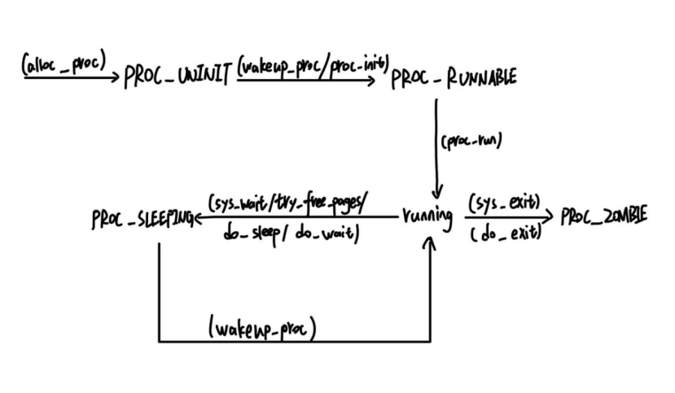

执行：make grade。如果所显示的应用程序检测都输出ok，则基本正确。（使用的是qemu-1.0.1）
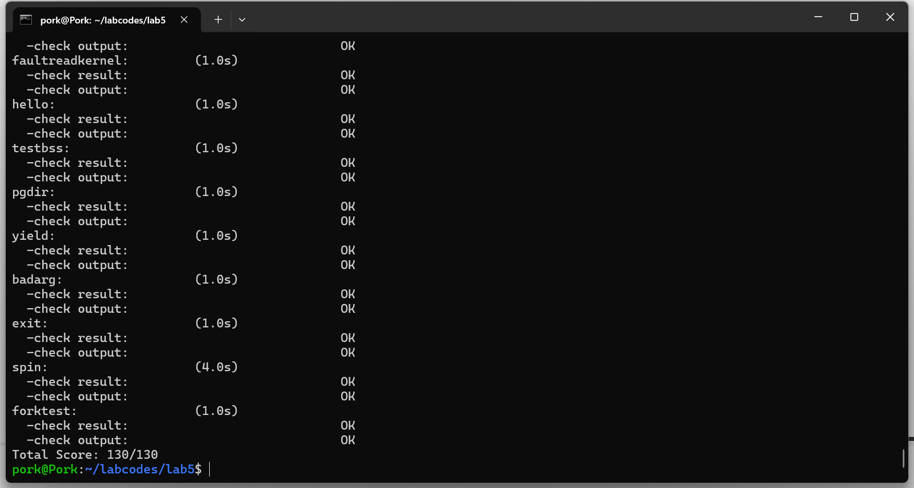
## 扩展练习 Challenge

实现 Copy on Write （COW）机制

给出实现源码,测试用例和设计报告（包括在cow情况下的各种状态转换（类似有限状态自动机）的说明）。

这个扩展练习涉及到本实验和上一个实验“虚拟内存管理”。在ucore操作系统中，当一个用户父进程创建自己的子进程时，父进程会把其申请的用户空间设置为只读，子进程可共享父进程占用的用户内存空间中的页面（这就是一个共享的资源）。当其中任何一个进程修改此用户内存空间中的某页面时，ucore会通过page fault异常获知该操作，并完成拷贝内存页面，使得两个进程都有各自的内存页面。这样一个进程所做的修改不会被另外一个进程可见了。请在ucore中实现这样的COW机制。

由于COW实现比较复杂，容易引入bug，请参考 https://dirtycow.ninja/ 看看能否在ucore的COW实现中模拟这个错误和解决方案。需要有解释。

这是一个big challenge.

说明该用户程序是何时被预先加载到内存中的？与我们常用操作系统的加载有何区别，原因是什么？

在实现 COW 的系统中，用户程序的内存页面不需要在一开始就全部加载到内存中。
当父进程创建子进程时：
用户地址空间中的页面不会被直接复制，而是通过将页表项标记为只读，允许父子进程共享相同的物理内存页面。
页面的实际复制发生在首次写入操作时，触发缺页异常，由内核完成页面的分配和数据复制。

```c
int do_pgfault(struct mm_struct *mm, uint_t error_code, uintptr_t addr) {
    int ret = -E_INVAL;
    struct vma_struct *vma = find_vma(mm, addr);
    pgfault_num++;

    if (vma == NULL || vma->vm_start > addr) {
        cprintf("not valid addr %x, and cannot find it in vma\n", addr);
        goto failed;
    }

    uint32_t perm = PTE_U;
    if (vma->vm_flags & VM_WRITE) {
        perm |= PTE_W; // 标记页面可写
    }
    addr = ROUNDDOWN(addr, PGSIZE);

    ret = -E_NO_MEM;
    pte_t *ptep = NULL;

    if ((ptep = get_pte(mm->pgdir, addr, 1)) == NULL) {
        cprintf("get_pte in do_pgfault failed\n");
        goto failed;
    }

    if (*ptep == 0) {
        // 页表项不存在，分配页面并映射
        if (pgdir_alloc_page(mm->pgdir, addr, perm) == NULL) {
            cprintf("pgdir_alloc_page in do_pgfault failed\n");
            goto failed;
        }
    } else if (!(*ptep & PTE_W)) {
        // 页表项存在但不可写，检查是否需要 COW
        struct Page *page = pte2page(*ptep);

        // 如果页面是共享的（引用计数 > 1），执行 COW
        if (page_ref_count(page) > 1) {
            struct Page *new_page = alloc_page();
            if (new_page == NULL) {
                cprintf("alloc_page in do_pgfault failed\n");
                goto failed;
            }

            // 复制原页面内容到新页面
            void *src_kvaddr = page2kva(page);
            void *dst_kvaddr = page2kva(new_page);
            memcpy(dst_kvaddr, src_kvaddr, PGSIZE);

            // 更新页表，映射新页面
            if (page_insert(mm->pgdir, new_page, addr, perm) != 0) {
                cprintf("page_insert in do_pgfault failed\n");
                goto failed;
            }

            // 减少原页面的引用计数
            page_ref_dec(page);
        } else {
            // 页面是独占的，直接设置写权限
            *ptep |= PTE_W;
        }
    } else if (swap_init_ok) {
        // 页面交换逻辑
        struct Page *page = NULL;
        if (swap_in(mm, addr, &page) != 0) {
            cprintf("swap_in in do_pgfault failed\n");
            goto failed;
        }
        if (page_insert(mm->pgdir, page, addr, perm) != 0) {
            cprintf("page_insert in do_pgfault failed\n");
            goto failed;
        }
        swap_map_swappable(mm, addr, page, 1);
        page->pra_vaddr = addr;
    } else {
        cprintf("no swap_init_ok but ptep is %x, failed\n", *ptep);
        goto failed;
    }

    ret = 0;
failed:
    return ret;
}

```
判断共享页面

使用 page_ref_count(page) 检查页面的引用计数，判断是否是共享页面。
如果共享页面被写入，执行 COW 操作。
COW 操作

分配新页面 alloc_page。
复制原页面内容到新页面 memcpy。
更新页表映射到新页面，并设置写权限。
状态变化

共享状态 → 独占状态：减少原页面的引用计数，为当前进程分配新页面。
